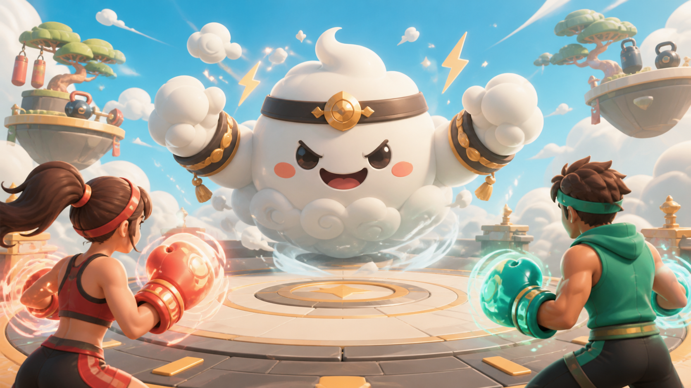

# PunchCam

PunchCam is a two-player webcam fitness game for couples and friends. Its main
mode, Couple Raid, turns a three-minute workout into a cooperative boss battle:
players punch, duck, and block together to complete chemistry missions and
trigger a shared special move. A classic boxing duel remains available for
competitive play.



The game uses MediaPipe Tasks Vision for upper-body pose detection and face
tracking. PunchCam recognizes straight punches, hooks, side dodges, ducks, and
blocks, then synchronizes the match over PeerJS / WebRTC so two players can
exercise, cooperate, or compete in real time.

## Features

- Two-player room flow with invite links
- Real-time webcam and data connection with PeerJS / WebRTC
- MediaPipe-based pose detection for punches, dodges, ducks, and blocks
- Three-minute Couple Raid with a shared boss health bar and duo energy meter
- Chemistry Combo missions, bonus damage, and a cooperative special move
- Synchronized boss telegraphs, attack frames, motion-based dodges, and hit reactions
- Downloadable post-match result poster for sharing
- Face tracking for animated 3D masks
- Classic three-round boxing duel with health, hits, damage, KO, and results
- Tutorial mode for practicing each motion before the match
- Sound effects, vibration feedback, hit effects, and optional tracking overlays

## Game Modes

### Couple Raid

Create a room, invite your partner, and defeat the daily boss together in a
three-minute workout. Every detected straight punch and hook damages the boss.
Coordinated actions complete Chemistry Combo missions, deal bonus damage, and
charge the shared special move.

The Cloud Champion attacks every few seconds. Each attack has a synchronized
wind-up, a dedicated action frame, and a MediaPipe-based defense check:

| Boss attack | Warning | Correct defense |
| --- | --- | --- |
| Thunder Straight | Fist rushes toward the camera | Dodge left or right |
| Cyclone Sweep | Horizontal wind arc crosses the arena | Duck |
| Cloudquake Slam | Both fists strike the arena floor | Raise both hands to block |

Successful defenses display a Perfect result. Missed defenses trigger camera
impact, sound, and vibration feedback. Player attacks also switch the boss to a
playful hit-stagger frame.

### Boxing Duel

Classic Duel keeps the original two-camera boxing format. Players compete over
three 60-second rounds using straight punches, hooks, side dodges, ducks, and
blocks.

## Tech Stack

- Vite
- React
- TypeScript
- MediaPipe Tasks Vision
- PeerJS / WebRTC
- Three.js
- Vitest
- Playwright

## Requirements

- Node.js `>=22.13.0`
- A browser with webcam support

## Install

```bash
npm install
```

## Local Development

Start the development server:

```bash
npm run dev
```

Then open the local URL printed by Vite, usually:

```text
http://localhost:5173
```

For the best experience, allow camera and microphone permissions when the
browser asks.

## Build

Create a production build:

```bash
npm run build
```

Preview the production build locally:

```bash
npm run preview
```

## Tests

Run unit tests:

```bash
npm test
```

Run type checking:

```bash
npm run lint
```

Run end-to-end tests:

```bash
npm run test:e2e
```

Current automated coverage includes:

- Punch, hook, dodge, duck, block, calibration, and damage rules
- Couple Raid action damage, Chemistry Combo timing, and match results
- Boss attack counters, telegraph/attack/recovery timeline, and scene selection
- Availability of every boss action image
- Lobby mode switching, invite URL handling, compact Raid cameras, and mobile layout

The camera-driven two-device flow should also be smoke-tested on real hardware
before a public release because webcam framing and network conditions vary by device.

## TURN Server Configuration

PunchCam includes a public STUN server by default. If you need better support
for strict NAT networks, configure a TURN server with these environment
variables:

```bash
VITE_TURN_URL=
VITE_TURN_USERNAME=
VITE_TURN_CREDENTIAL=
```

Create a local `.env` file from `.env.example` if needed.
